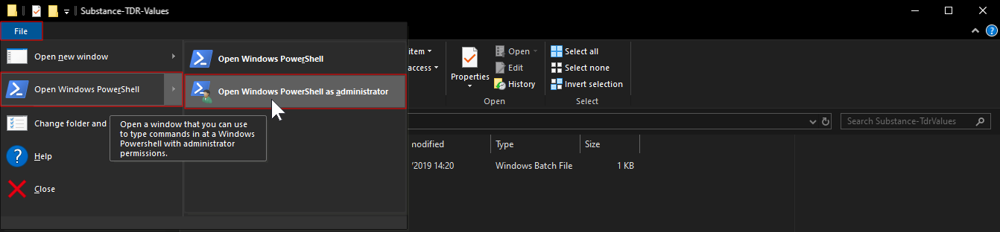
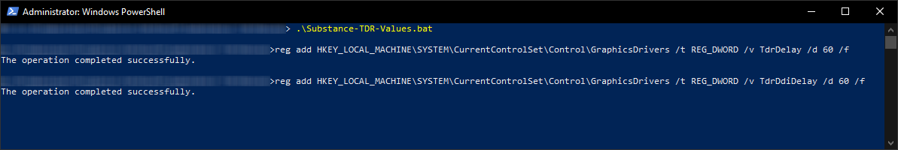

# Substance TDR-Values
This script (Substance-TdrValues.bat) sets the registry values TdrDelay and TdrDdiDelay to the recommended amounts.
If your Substance software keeps crashing within heavy GPU computations or shows you the following prompt after starting it, this script may solve your problem as it sets the recommended TDR (Timeout Detection Recovery) for Substance.
For more information on this issue visit the [Substance Painter docs](https://docs.substance3d.com/spdoc/gpu-drivers-crash-with-long-computations-128745489.html).

## Manual

1) Download the script [here](../../raw/master/Substance-TdrValues.bat).

2) Open the folder containing the script in the File Explorer.

3) In the File Explorer, go to File > Open Windows PowerShell > Open Windows PowerShell as administrator.

4) In the PowerShell type *.\Substance-TdrValues.bat* and press Enter. Your PowerShell result should look like this:

5) Whenever the issue comes up again, just re-run the script via PowerShell as administrator.
